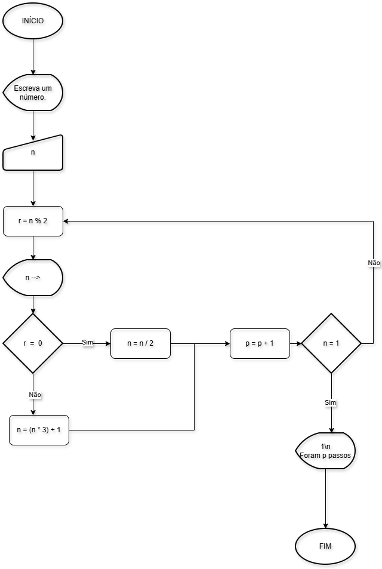

# Conjectura de Collatz
Recebeu este nome em referência ao matemático alemão Lothar Collatz. A Conjectura de Collatz, ou problema, é um enigma matemático simples: para qualquer inteiro positivo, se par, divida por 2; se ímpar, multiplique por 3 e some 1. A conjectura afirma que, repetindo o processo, todos os números chegam ao ciclo que é 1.
- Apesar de testada até números altíssimos, nunca foi provada.
## Trabalho
O arquivo "collatz.c" apresenta o algorítmo dessa história. A seguir, apresento o fluxograma dessa operação:

